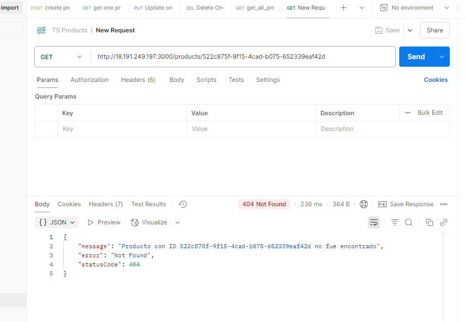

## Solución técnica

### 1. CRUD API con NestJS
- Se implementó una API REST con operaciones completas sobre `productos`.
- Se usó PostgreSQL + TypeORM como ORM.
- Se validan entradas mediante `DTOs` y `class-validator`.

### 2. Tests unitarios
- Se cubren los servicios con Jest.
- Se simulan llamadas a la base de datos usando mocks (`jest.fn()`).
- Se valida comportamiento y errores esperados (404, etc.).

### 3. Despliegue AWS (explicación técnica)
- ¿Cómo desplegar la API en AWS ECS + RDS?
  Para este primer momento se mostrará como realizar la operación de una manera manual,
  sin terraform;
  -  Primero dockericé la aplicación NestJS y subí la imagen a ECR. Luego, creé una base de datos PostgreSQL en RDS, accesible desde la red pública. Finalmente, configuré un clúster de ECS tipo Fargate con una definición de tarea (al final fueron 4) que usa esa imagen Docker y conecta con la base de datos mediante variables de entorno. El servicio quedó accesible por IP pública en el puerto 3000.
  
  
  

- Contenedor Docker desplegado en ECS (Fargate).
- Base de datos gestionada en RDS PostgreSQL.
- Secretos gestionados mediante AWS Secrets Manager.
- Terraform para definir infraestructura como código.

### 4. CI/CD con GitHub Actions
- Ejecución de pruebas en cada push o PR.
- (Opcional) Despliegue automático usando Terraform y AWS CLI.

### ✅ Decisiones técnicas
- Se usó TypeORM para aprovechar su integración nativa con NestJS y así evitar posibles errores de sincronización.
- Se modeló un flujo típico de producción usando prácticas profesionales.
- El código es modular, con `services`, `controllers`, `dto` y `entities`.
- Aunque la entitie en esta ocasión solo fuese una, se decidió dejar en una carpeta aparte por temas de buenas prácticas.
- Se decidió hacer un test minimo por cada servicio para así probar toda la funcionalidad.
. Se decidió manejar error de formato de id por url (formato UUID inválido) con ParseUUIDPipe, y así ahorrarse la validación manual.

